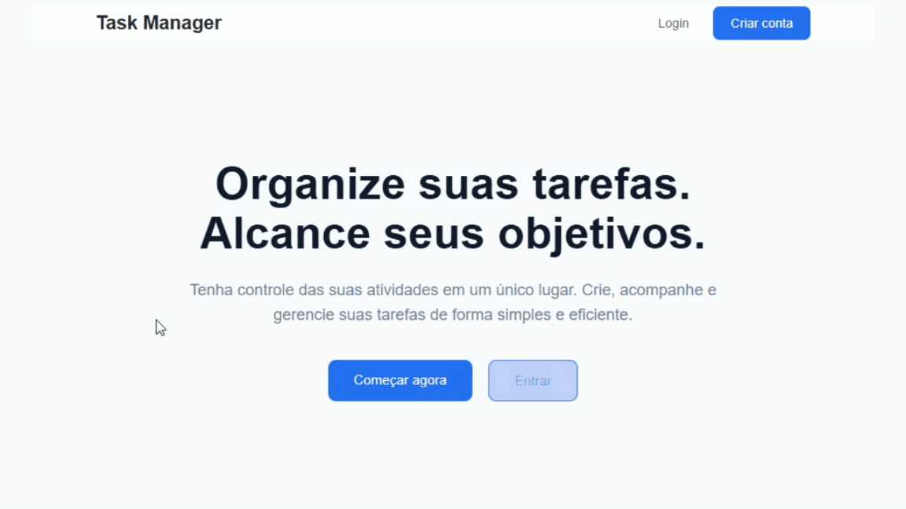

# API para gerenciamento de tarefas (To-Do)

<p align="center">
  
</p>

API REST para gerenciamento de tarefas desenvolvida como solução para um desafio técnico utilizando **Python**, **Django REST Framework**, **PostgreSQL** e **Docker**.

O projeto implementa todos os requisitos obrigatórios descritos no desafio técnico e também contempla os diferenciais sugeridos, além de possuir uma **interface web desenvolvida com templates do Django**, permitindo utilizar todas as funcionalidades da aplicação diretamente pelo navegador.

---

## Sumário

- [Tecnologias](#tecnologias)
- [Estrutura do projeto](#estrutura-do-projeto)
- [Decisões de arquitetura](#decisões-de-arquitetura)
- [Como executar o projeto](#como-executar-o-projeto)
  - [Pré-requisitos](#pré-requisitos)
  - [Instalação](#instalação)
- [Interface Web](#interface-web)
- [Endpoints da API](#endpoints-da-api)
  - [Autenticação](#autenticação)
  - [Tarefas](#tarefas)
- [Executando os testes](#executando-os-testes)
- [Diferenciais implementados](#diferenciais-implementados)

---

# Tecnologias

- Python
- Django
- Django REST Framework
- PostgreSQL
- Docker
- Docker Compose
- JWT (Simple JWT)
- Pytest
- Pytest-Django
- Pytest-Cov
- Ruff
- Black

---

# Estrutura do projeto

```text
config/      Configurações do projeto Django
users/       Autenticação, gerenciamento de usuários e testes
tasks/       CRUD, filtros, regras de negócio e testes das tarefas
web/         Interface Web (Home, Login, Cadastro e Dashboard)
```

---

# Decisões de arquitetura

Algumas decisões foram tomadas para manter o projeto organizado, escalável e de fácil manutenção.

- Separação da aplicação por domínio (`users` e `tasks`);
- Validações centralizadas nos Serializers;
- Camada de Services para encapsular regras de negócio;
- Soft Delete para preservar o histórico das tarefas;
- Autenticação utilizando JWT;
- Isolamento das tarefas por usuário autenticado;
- Organização dos filtros em um módulo específico;
- Padronização das respostas da API;
- Testes automatizados cobrindo os principais fluxos da aplicação.

---

# Como executar o projeto

## Pré-requisitos

Antes de iniciar, é necessário possuir instalado:

- Python 3.12 ou superior;
- Docker e Docker Compose.

## Instalação

Clone o repositório:

```bash
git clone https://github.com/miguelrsant/desafio-backend.git
cd desafio-backend
```

Instale as dependências:

```bash
pip install -r requirements.txt
```

O projeto possui um arquivo `.env` versionado apenas como exemplo, contendo a configuração utilizada durante o desenvolvimento.

Inicie o banco de dados:

```bash
docker compose up -d
```

Execute as migrações:

```bash
python manage.py migrate
```

Inicie a aplicação:

```bash
python manage.py runserver
```

Após iniciar o servidor, a aplicação estará disponível em:

```text
http://localhost:8000
```

Neste endereço estarão disponíveis:

- A Interface Web;
- Os endpoints da API REST.

---

# Interface Web

Além da API REST, o projeto possui uma interface desenvolvida utilizando **Django Templates**, permitindo utilizar todas as funcionalidades diretamente pelo navegador.

As seguintes páginas estão disponíveis:

| Página | Descrição |
| ------- | --------- |
| `/` | Página inicial (Home) |
| `/login` | Login de usuários |
| `/register` | Cadastro de usuários |
| `/dashboard` | Gerenciamento das tarefas |

Através da interface é possível:

- Realizar cadastro de usuários;
- Fazer login;
- Criar tarefas;
- Listar tarefas;
- Atualizar tarefas;
- Excluir tarefas (Soft Delete);
- Filtrar tarefas por título e status.

---

# Endpoints da API

## Autenticação

### Criar usuário

```http
POST /users/register
```

Cria um novo usuário.

**Exemplo de requisição**

```json
{
  "username": "usuario",
  "password": "12345678"
}
```

---

### Login

```http
POST /users/login
```

Autentica um usuário e retorna um token JWT.

**Exemplo de requisição**

```json
{
  "username": "usuario",
  "password": "12345678"
}
```

---

## Tarefas

> Todos os endpoints abaixo exigem autenticação via JWT.

### Listar tarefas

```http
GET /tasks
```

Filtros disponíveis:

| Parâmetro | Descrição |
| --------- | --------- |
| `title` | Filtra tarefas pelo título |
| `status` | Filtra tarefas pelo status (`PENDING`, `IN_PROGRESS` ou `COMPLETED`) |

Exemplo:

```http
GET /tasks?title=Estudar&status=PENDING
```

---

### Criar tarefa

```http
POST /tasks
```

**Exemplo de requisição**

```json
{
  "title": "Django",
  "description": "Finalizar desafio técnico",
  "status": "PENDING"
}
```

---

### Atualizar tarefa

```http
PUT /tasks/{id}
```

Atualiza uma tarefa existente.

**Exemplo de requisição**

```json
{
  "title": "Django REST",
  "description": "Finalizar desafio técnico",
  "status": "COMPLETED"
}
```

---

### Excluir tarefa

```http
DELETE /tasks/{id}
```

Realiza a exclusão lógica (Soft Delete). A tarefa deixa de ser retornada pela API, mas permanece armazenada no banco de dados para preservar o histórico.

---

# Executando os testes

Executar todos os testes:

```bash
pytest
```

Executar os testes com relatório de cobertura:

```bash
pytest --cov=. --cov-report=term-missing
```

---

# Diferenciais implementados

Além dos requisitos obrigatórios do desafio, foram implementadas melhorias para tornar a aplicação mais organizada, robusta e próxima de um ambiente de desenvolvimento real.

- Interface Web utilizando Django Templates;
- API REST construída com Django REST Framework;
- Autenticação utilizando JWT;
- CRUD completo de tarefas;
- Filtros por título e status;
- Exclusão lógica (Soft Delete);
- Isolamento de tarefas por usuário autenticado;
- Padronização das respostas da API;
- Arquitetura organizada por domínio (`users` e `tasks`);
- Separação das regras de negócio em Services;
- Testes automatizados com Pytest;
- Cobertura de testes com `pytest-cov`;
- Formatação automática de código com Black;
- Análise estática utilizando Ruff;
- Banco de dados PostgreSQL executado via Docker Compose.